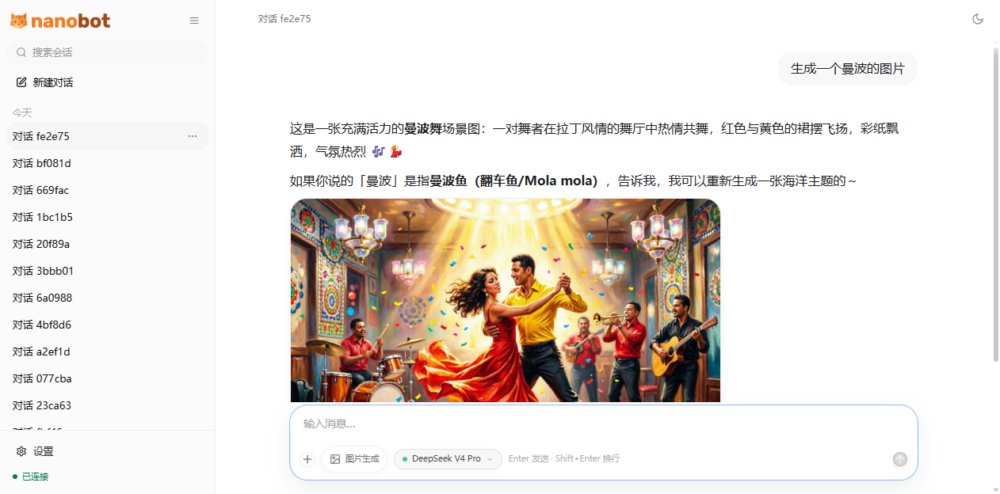
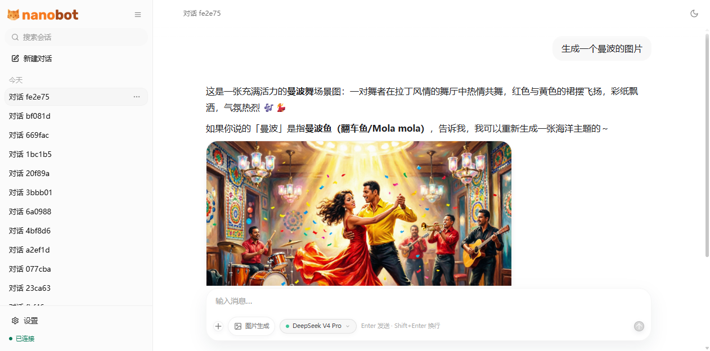

<div align="center">
  <p>
    <a href="https://pypi.org/project/nanobot-ai/"></a>
    <a href="https://pepy.tech/project/nanobot-ai"></a>
    
    
    <a href="https://github.com/HKUDS/nanobot/graphs/commit-activity" target="_blank">
        </a>
    <a href="https://github.com/HKUDS/nanobot/issues?q=is%3Aissue%20is%3Aclosed" target="_blank">
        </a>
    <a href="https://twitter.com/intent/follow?screen_name=nanobot_project" target="_blank">
        </a>
    <a href="https://nanobot.wiki/docs/latest/getting-started/nanobot-overview"></a>
    <a href="./COMMUNICATION.md"></a>
    <a href="./COMMUNICATION.md"></a>
    <a href="https://discord.gg/MnCvHqpUGB"></a>
  </p>
</div>

🐈 **nanobot** is an open-source, ultra-lightweight AI agent framework written in Python with a React/TypeScript WebUI. It centers around a compact, readable agent loop that receives messages from chat channels, invokes LLM providers, executes tools, and manages session memory — all with a small, hackable core.

## 📢 News

- **2026-04-29** 🚀 Released **v0.1.5.post3** — Smarter threads on Feishu, Discord, Slack, and Teams; **DeepSeek-V4**; Hugging Face & Olostep; choices, `/history`, and steadier long chats.
- **2026-04-21** 🚀 Released **v0.1.5.post2** — Windows & Python 3.14 support, Office document reading, SSE streaming for the OpenAI-compatible API.
- **2026-04-14** 🚀 Released **v0.1.5.post1** — Dream skill discovery, mid-turn follow-up injection, WebSocket channel, and deeper channel integrations.
- **2026-04-05** 🚀 Released **v0.1.5** — sturdier long-running tasks, Dream two-stage memory, production-ready sandboxing.

<details>
<summary>Earlier news</summary>

- **2026-03-27** 🚀 Released **v0.1.4.post6** — architecture decoupling, litellm removal, end-to-end streaming, WeChat channel.
- **2026-03-16** 🚀 Released **v0.1.4.post5** — stronger reliability, channel support.
- **2026-03-08** 🚀 Released **v0.1.4.post4** — safer defaults, multi-instance support, sturdier MCP.
- **2026-02-28** 🚀 Released **v0.1.4.post3** — cleaner context, hardened session history.
- **2026-02-24** 🚀 Released **v0.1.4.post2** — redesigned heartbeat, prompt cache optimization.
- **2026-02-21** 🎉 Released **v0.1.4.post1** — new providers, media support across channels.
- **2026-02-17** 🎉 Released **v0.1.4** — MCP support, progress streaming, new providers.
- **2026-02-13** 🎉 Released **v0.1.3.post7** — security hardening.
- **2026-02-07** 🚀 Released **v0.1.3.post5** — Qwen support.
- **2026-02-04** 🚀 Released **v0.1.3.post4** — multi-provider & Docker support.
- **2026-02-02** 🎉 nanobot officially launched!

</details>

---

## 🚀 Quick Start

```bash
# 1. Install
pip install nanobot-ai

# 2. Initialize (interactive setup wizard)
nanobot onboard

# 3. Start the gateway
nanobot gateway

# 4. Open WebUI
# Visit http://127.0.0.1:5173 (dev) or http://127.0.0.1:18790/webui (prod)

# 5. Chat in terminal
nanobot agent
```

**One-liner from source:**

```bash
git clone https://github.com/HKUDS/nanobot.git && cd nanobot && pip install -e . && nanobot onboard
```

---

## 🏗️ Agent Framework

nanobot's architecture is built around a **small, single-threaded agent loop** — messages flow through an async `MessageBus` that decouples chat channels from the agent core.

```
┌────────────────────────────────────────────────────────────┐
│                      MessageBus                            │
│  ┌──────────┐   ┌──────────┐   ┌──────────┐              │
│  │ Telegram │   │ Discord  │   │ WebSocket│  ... channels │
│  └────┬─────┘   └────┬─────┘   └────┬─────┘              │
│       │               │               │                    │
│       ▼               ▼               ▼                    │
│  ┌──────────────────────────────────────────────┐         │
│  │              AgentLoop                        │         │
│  │  ┌─────────┐  ┌──────────┐  ┌────────────┐  │         │
│  │  │ Build   │  │  Agent   │  │   Save     │  │         │
│  │  │ Context ├─►│  Runner  ├─►│  Session   │  │         │
│  │  └─────────┘  └────┬─────┘  └────────────┘  │         │
│  │                    │                          │         │
│  │     ┌──────────────┼──────────────┐          │         │
│  │     ▼              ▼              ▼          │         │
│  │  ┌──────┐    ┌──────────┐   ┌─────────┐     │         │
│  │  │ LLM  │    │   Tool   │   │ Session │     │         │
│  │  │Call  │    │ Execution│   │ Memory  │     │         │
│  │  └──────┘    └──────────┘   └─────────┘     │         │
│  └──────────────────────────────────────────────┘         │
└────────────────────────────────────────────────────────────┘
```

**Key components:**

| Component | Path | Role |
|-----------|------|------|
| **AgentLoop** | `nanobot/agent/loop.py` | Orchestrates turns: build context → run LLM → execute tools → save |
| **AgentRunner** | `nanobot/agent/runner.py` | Handles the LLM conversation loop: send messages, receive tool calls, stream responses |
| **ContextBuilder** | `nanobot/agent/context.py` | Assembles system prompts from identity, bootstrap files, memory, skills |
| **MessageBus** | `nanobot/bus/queue.py` | Async queue decoupling channels from the agent core |
| **ToolRegistry** | `nanobot/agent/tools/registry.py` | Dynamic tool registration and dispatch |
| **SessionManager** | `nanobot/session/manager.py` | Per-session history, context compaction, TTL-based auto-compaction |

**Turn lifecycle:**

```
BUILD → RESTORE → RUN → SAVE → RESPOND
```

---

## 🔧 Tools

nanobot ships with **17 built-in tools** that the LLM can invoke:

| Tool | Description |
|------|-------------|
| `read_file` | Read text, image, or document files (PDF, DOCX, XLSX, PPTX) |
| `write_file` | Write or overwrite content to a file |
| `edit_file` | Edit a file by replacing `old_text` with `new_text` |
| `list_dir` | List directory contents with optional recursion |
| `glob` | Find files matching a glob pattern |
| `grep` | Search file contents with regex patterns |
| `exec` | Execute shell commands (sandboxed) |
| `web_search` | Web search via Brave, Tavily, SearXNG, Kagi, Jina, or DuckDuckGo |
| `web_fetch` | Fetch a URL and extract readable markdown content |
| `generate_image` | Generate or edit images via OpenRouter, AIHubMix, or DashScope (qwen-image-2.0) |
| `describe_image` | Vision-capable image description |
| `notebook_edit` | Edit Jupyter `.ipynb` cells (replace, insert, delete) |
| `message` | Send proactive or cross-channel messages with attachments |
| `spawn` | Spawn background subagents for independent tasks |
| `cron` | Schedule reminders and recurring tasks |
| `ask_user` | Pause and ask the user a blocking question |
| `my` | Inspect or modify agent runtime state (model, config, scratchpad) |

**MCP (Model Context Protocol):** nanobot supports MCP servers — tools, resources, and prompts exposed by external MCP servers are dynamically registered at runtime. Configure via `tools.mcpServers` in `config.json`.

---

## 🧠 Long-Term Memory

nanobot features a **Dream two-phase memory consolidation** system:

```
┌──────────────────────────────────────────────┐
│                  Dream                        │
│  ┌────────────┐        ┌──────────────┐      │
│  │  Phase 1   │        │   Phase 2    │      │
│  │  Analyze   │───────►│  Edit Memory │      │
│  │  History   │        │  & Skills    │      │
│  └────────────┘        └──────────────┘      │
│       ▲                        │              │
│       │                        ▼              │
│  history.jsonl           MEMORY.md           │
│  (append-only log)       skills/             │
└──────────────────────────────────────────────┘
```

**How it works:**

1. **Phase 1** — Reads recent history from `history.jsonl` (append-only JSONL), produces an analysis summary via an LLM call. Supports line-age annotation for `MEMORY.md` entries (git-blame-based staleness markers like `← 30d`).

2. **Phase 2** — Delegates to AgentRunner with `read_file` / `edit_file` / `write_file` tools to make targeted incremental edits to `MEMORY.md` and create skills under `skills/`.

**Storage** (`<workspace>/memory/`):
- `MEMORY.md` — Long-term memory (markdown, auto-managed)
- `history.jsonl` — Append-only conversation log
- `SOUL.md` — Agent personality / identity
- `USER.md` — User preferences
- `.cursor` / `.dream_cursor` — Processing position trackers

Memory is versioned via GitStore and capped at 32KB for `MEMORY.md`. Dream runs on a configurable cron interval (default: every 2 hours).

---

## 📂 Project Structure

```
MyBot/
├── nanobot/                          # Core Python package
│   ├── agent/                        # Agent loop, runner, memory, tools
│   │   ├── loop.py                   # Main agent orchestration
│   │   ├── runner.py                 # LLM conversation + tool execution
│   │   ├── context.py                # Context / prompt assembly
│   │   ├── memory.py                 # Dream memory consolidation
│   │   ├── skills.py                 # Skill discovery and loading
│   │   ├── hook.py                   # Lifecycle hook system
│   │   └── tools/                    # 17 built-in tools (see Tools section)
│   ├── api/                          # OpenAI-compatible HTTP API (aiohttp)
│   ├── bus/                          # Async event bus (channel ↔ agent)
│   ├── channels/                     # 12+ chat platform integrations
│   │   ├── websocket.py              # WebUI WebSocket transport
│   │   ├── telegram.py               # Telegram bot
│   │   ├── discord.py                # Discord bot
│   │   ├── slack.py                  # Slack app
│   │   ├── feishu.py                 # Feishu / Lark
│   │   ├── qq.py                     # QQ bot
│   │   ├── wecom.py                  # WeCom bot
│   │   ├── weixin.py                 # WeChat channel
│   │   ├── whatsapp.py               # WhatsApp bridge
│   │   ├── matrix.py                 # Matrix client
│   │   ├── dingtalk.py               # DingTalk bot
│   │   ├── msteams.py                # MS Teams bot
│   │   ├── email.py                  # Email channel
│   │   └── mochat.py                 # MoChat connector
│   ├── cli/                          # Typer CLI (gateway, agent, onboard, ...)
│   ├── config/                       # Pydantic config schema + loader
│   ├── providers/                    # 30+ LLM provider adapters
│   │   ├── registry.py               # Provider discovery + model lists
│   │   ├── factory.py                # Provider instantiation
│   │   ├── base.py                   # Common provider contract
│   │   ├── anthropic_provider.py     # Anthropic (native SDK)
│   │   ├── openai_compat_provider.py # OpenAI-compatible (openai SDK)
│   │   ├── dashscope_image.py        # DashScope image generation
│   │   └── image_generation.py       # Shared image gen client base
│   ├── session/                      # Session history + compaction
│   ├── cron/                         # Cron scheduler
│   ├── security/                     # Sandbox + SSRF protection
│   ├── skills/                       # Built-in skills (weather, cron, ...)
│   ├── templates/                    # Jinja2 prompt templates
│   └── utils/                        # Helpers, git store, artifacts
├── webui/                            # React 18 + TypeScript frontend
│   └── src/
│       ├── components/               # React components (MessageBubble, ...)
│       ├── hooks/                    # useNanobotStream, useSessions, ...
│       └── lib/                      # Types, media utils, i18n
├── bridge/                           # TypeScript bridge services
├── tests/                            # 2700+ pytest tests
├── docs/                             # Documentation
└── images/                           # README images
```

---

## 🛠️ Tech Stack

**Backend (Python ≥ 3.11)**

| Layer | Libraries |
|-------|-----------|
| AI SDKs | `anthropic` ≥ 0.45, `openai` ≥ 2.8, `tiktoken` |
| Web | `aiohttp` (API), `websockets`, `python-socketio` |
| CLI | `typer`, `rich`, `prompt-toolkit`, `questionary` |
| Config | `pydantic` ≥ 2.12, `pydantic-settings` |
| MCP | `mcp` ≥ 1.26 |
| Integrations | `python-telegram-bot`, `slack-sdk`, `lark-oapi`, `dingtalk-stream`, `qq-botpy` |
| Misc | `httpx`, `jinja2`, `pyyaml`, `loguru`, `croniter`, `ddgs` |

**Frontend (React 18 + TypeScript 5)**

| Layer | Libraries |
|-------|-----------|
| Build | Vite 5, Vitest 2 |
| UI | React 18, Tailwind CSS 3, Radix UI primitives |
| Markdown | `react-markdown`, `remark-gfm`, `remark-math`, `rehype-katex` |
| i18n | `i18next`, `react-i18next` |
| Icons | `lucide-react` |

---

## 🌐 API

nanobot exposes an **OpenAI-compatible HTTP API** (`nanobot/api/server.py`) for integration with tools and automations:

| Method | Endpoint | Description |
|--------|----------|-------------|
| `POST` | `/v1/chat/completions` | Chat completions (JSON + multipart/form-data). Supports `stream: true` for SSE. |
| `GET` | `/v1/models` | List available models |
| `GET` | `/health` | Health check → `{"status": "ok"}` |

**Example:**

```bash
curl http://127.0.0.1:8900/v1/chat/completions \
  -H "Content-Type: application/json" \
  -d '{"model": "deepseek-v4-pro", "messages": [{"role": "user", "content": "Hello!"}], "stream": false}'
```

**WebSocket protocol** (`ws://127.0.0.1:8765`): Used by the WebUI for real-time streaming chat. Events: `delta`, `stream_end`, `thinking`, `message`, `turn_end`, `session_updated`.

See [OpenAI-Compatible API](./docs/openai-api.md) and [Python SDK](./docs/python-sdk.md) for more details.

---

## 🔐 Environment Variables

**Core:**

| Variable | Default | Description |
|----------|---------|-------------|
| `NANOBOT_LLM_TIMEOUT_S` | 300 | LLM request timeout (seconds) |
| `NANOBOT_MAX_CONCURRENT_REQUESTS` | 3 | Max concurrent agent turns |

**Provider API keys** (primary ones):

| Variable | Provider |
|----------|----------|
| `ANTHROPIC_API_KEY` | Anthropic |
| `OPENAI_API_KEY` | OpenAI, AiHubMix, SiliconFlow, VolcEngine, BytePlus |
| `DASHSCOPE_API_KEY` | DashScope (Qwen) |
| `DEEPSEEK_API_KEY` | DeepSeek |
| `MOONSHOT_API_KEY` | Moonshot (Kimi) |
| `GEMINI_API_KEY` | Google Gemini |
| `GROQ_API_KEY` | Groq |
| `MISTRAL_API_KEY` | Mistral |
| `OPENROUTER_API_KEY` | OpenRouter |
| `HF_TOKEN` | Hugging Face |

**Tool-specific:**

| Variable | Tool |
|----------|------|
| `BRAVE_API_KEY` | Brave web search |
| `TAVILY_API_KEY` | Tavily web search |
| `SEARXNG_BASE_URL` | SearXNG web search |
| `JINA_API_KEY` | Jina Reader (web fetch) |
| `KAGI_API_KEY` | Kagi web search |

All values in `config.json` support `${VAR_NAME}` interpolation.

---

## 🧪 Testing

```bash
# Python tests (2700+ tests)
pytest tests/ -x -q

# Single test
pytest tests/test_openai_api.py::test_function -v

# Frontend tests
cd webui && bun run test

# Lint
ruff check nanobot/
```

---

## 🧪 WebUI

<p align="center">
  
</p>

<p align="center">
  
</p>

```bash
# 1. Enable WebSocket channel in ~/.nanobot/config.json
#    { "channels": { "websocket": { "enabled": true } } }

# 2. Start gateway
nanobot gateway

# 3. Start WebUI dev server
cd webui && bun install && bun run dev
#    → http://127.0.0.1:5173
```

See [WebUI README](./webui/README.md) for full development docs.

---

## 📚 Docs

- [Configuration](./docs/configuration.md) — LLM providers, web search, MCP, security
- [Chat Apps](./docs/chat-apps.md) — Telegram, Discord, Slack, Feishu, QQ, WeChat, WhatsApp, Matrix, DingTalk, Teams, Email
- [OpenAI-Compatible API](./docs/openai-api.md) — HTTP API for tool integrations
- [Python SDK](./docs/python-sdk.md) — Embed nanobot in your Python apps
- [Deployment](./docs/deployment.md) — Docker, Linux service, macOS LaunchAgent
- [WebUI](./webui/README.md) — WebUI development workflow
- [nanobot.wiki](https://nanobot.wiki/docs/latest/getting-started/nanobot-overview) — Stable release docs

## 🤝 Contribute

PRs welcome! The codebase is intentionally small and readable.

| Branch | Purpose |
|--------|---------|
| `main` | Stable releases — bug fixes and minor improvements |
| `nightly` | Experimental features — new features and breaking changes |

See [CONTRIBUTING.md](./CONTRIBUTING.md) for details.

## Contact

Started by [Xubin Ren](https://github.com/re-bin). Contact: [xubinrencs@gmail.com](mailto:xubinrencs@gmail.com).

### Contributors

<a href="https://github.com/HKUDS/nanobot/graphs/contributors">
  
</a>

## ⭐ Star History

<div align="center">
  <a href="https://star-history.com/#HKUDS/nanobot&Date">
    <picture>
      <source media="(prefers-color-scheme: dark)" srcset="https://api.star-history.com/svg?repos=HKUDS/nanobot&type=Date&theme=dark" />
      <source media="(prefers-color-scheme: light)" srcset="https://api.star-history.com/svg?repos=HKUDS/nanobot&type=Date" />
      
    </picture>
  </a>
</div>

<p align="center">
  <em> Thanks for visiting ✨ nanobot!</em><br><br>
  
</p>
